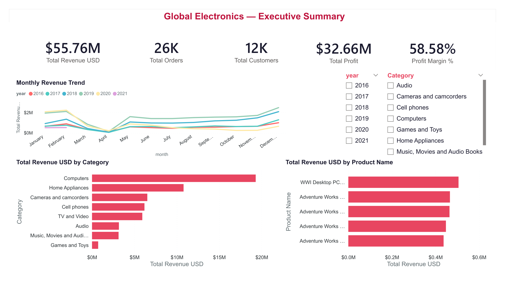
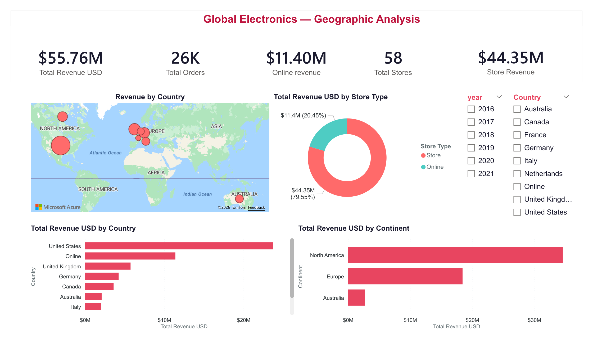
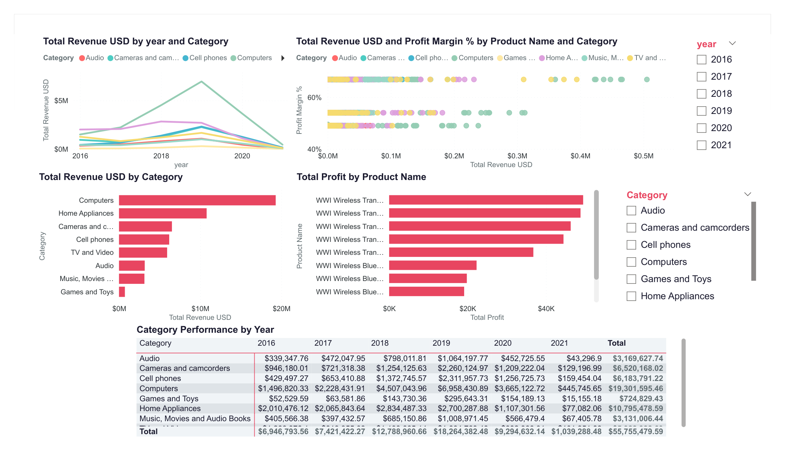

README

# Global Electronics Sales Report

Power BI analysis of **Global Electronics** retail sales: revenue trends, geographic and store-channel views, category and product performance, and customer behavior. This repository ships the report package, a fixed-layout PDF export, supporting CSV datasets from the same workspace, and readme previews rendered from that PDF so GitHub visitors see the visuals without opening files.

**Repository:** [github.com/Beepeen78/-Global_electronics](https://github.com/Beepeen78/-Global_electronics)

## Report preview

The images below are exported from [`global_electronics.pdf`](global_electronics.pdf) (four pages).

### Page 1 — Executive summary

Global Electronics–style KPIs (for example total revenue about **$55.8M**, orders **26K**, customers **12K**, total profit about **$32.7M**), monthly revenue trend, revenue by category, top products by revenue, and year/category slicers.



Global electronics sales report — page 1 executive summary

### Page 2 — Geographic analysis

Map and bar-chart views by **country** and **continent**, revenue split across **online vs store** style metrics, store counts, and slicers for year and country.



Global electronics sales report — page 2 geographic analysis

### Page 3 — Product analysis

Category and product revenue and profit, margin vs revenue scatter, revenue by year and category (line), pivot matrix by year, and slicers for year and category.



Global electronics sales report — page 3 product analysis

### Page 4 — Customer analysis

Customer KPIs (totals, repeat customers, average revenue), revenue by country, top customers by revenue, segment and order-behavior charts, and slicers for year and customer country.


Global electronics sales report — page 4 customer analysis

## What is in this repository

| Asset | Description |
|--------|-------------|
| `global_electronics.pbix` | Power BI report and semantic model. **Import** pipeline from the CSVs in this folder (star schema with `dim_date` and a central measure table). PBIX metadata can show **cloud authoring**; if refresh prompts for paths, point Power Query to these files. **Azure Map** visuals may require sign-in depending on your environment. |
| `global_electronics.pdf` | Pixel-perfect export of the report (used to generate the readme screenshots above). |
| `*.csv` | Tabular datasets: `Sales`, `Customers`, `Products`, `Stores`, `Exchange_Rates`, plus `Data_Dictionary.csv` for field definitions. Use them for your own models or tooling; they back the shipped PBIX when connected as file sources. |
| `docs/readme/` | PNG previews (`report-page-01.png` … `report-page-04.png`) extracted from the PDF for this readme. |

## Getting started

- **View the story quickly:** scroll the preview section above, or open [`global_electronics.pdf`](global_electronics.pdf) locally.
- **Edit or explore interactively:** install [Power BI Desktop](https://powerbi.microsoft.com/desktop/), open `global_electronics.pbix`, and **refresh** data (fix CSV folder paths if the file is moved). Sign in if prompted for map-backed visuals.
- **Work offline with files:** import the CSVs into a new Power BI (or Fabric) model and rebuild or reconnect visuals if you want a fully self-contained, file-only workflow.

## Regenerating readme images

If you replace the PDF and want new thumbnails:

```bash
pip install pymupdf
python -c "import fitz; from pathlib import Path; pdf=Path('global_electronics.pdf'); out=Path('docs/readme'); out.mkdir(parents=True, exist_ok=True); doc=fitz.open(pdf); m=fitz.Matrix(2.25,2.25); [doc[i].get_pixmap(matrix=m,alpha=False).save(out/f'report-page-{i+1:02d}.png') for i in range(len(doc))]; doc.close()"
```

Then commit the updated `docs/readme/*.png` and adjust this readme if the page count changes.

## Data model (reference)

- **Fact:** `Sales` (order line)  
- **Dimensions:** `Customers`, `Products`, `Stores`, `Exchange_Rates`  
- **Calendar:** `dim_date`  
- **Measures:** `Table_measure` (DAX KPIs used across pages)

## Credits

Global Electronics–style dataset and scenario are typical of analytics learning tracks; cite your course or source if you republish.

Power BI is a trademark of Microsoft Corporation.

## Author

**Beepeen78** — [GitHub profile](https://github.com/Beepeen78)
