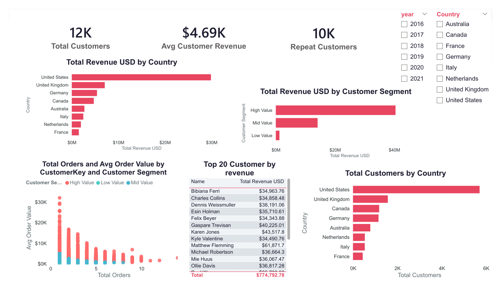

# Global Electronics — Analytics & Power BI

Portfolio project that combines a **Global Electronics** sales dataset (CSV) with a **Power BI** semantic model and multi-page report. Built for learning: star-schema modeling, DAX measures, and dashboard design.

**Repository:** [github.com/Beepeen78/-Global_electronics](https://github.com/Beepeen78/-Global_electronics)

---

## What’s included

| Asset | Description |
|--------|----------------|
| `Customers.csv` | Customer demographics and geography |
| `Products.csv` | Product catalog, pricing, and category hierarchy |
| `Sales.csv` | Order-line facts (dates, keys, quantity, currency) |
| `Stores.csv` | Store locations and attributes |
| `Exchange_Rates.csv` | Daily FX rates to support USD normalization |
| `Data_Dictionary.csv` | Field-level definitions for all source tables |
| `global_electronics.pbix` | Power BI Desktop report and data model |
| `global_electronics.pdf` | Exported report (PDF); same pages as below |

---

## Business context

The dataset represents **electronics retail** activity: customers place orders that reference **products** and are fulfilled through **stores** (including online-style scenarios where store key may indicate a non-physical channel in the model). **Exchange rates** allow revenue and margin analysis in a **common currency (USD)**.

---

## Data model (high level)

The Power BI model follows a **star schema** aligned with the CSVs:

- **Fact:** `Sales` (grain: order line)
- **Dimensions:** `Customers`, `Products`, `Stores`, `Exchange_Rates`
- **Calendar:** `dim_date` (date table for time intelligence and slicers)
- **Measures:** `Table_measure` (central measure table for KPIs and visuals)

Relationships connect facts to dimensions on keys such as `CustomerKey`, `ProductKey`, and `StoreKey`, with dates tied to `dim_date` for trends and filters.

---

## Report pages (`global_electronics.pbix`)

| Page | Focus |
|------|--------|
| **Executive summary** | KPIs, monthly revenue trend, revenue by category and top products, year/category slicers |
| **Geographic analysis** | Map and charts by geography, store vs online style metrics, continent and store-type views |
| **Product analysis** | Category and product performance, margin vs revenue scatter, pivot by year, scatter and line trends |
| **Customer analysis** | Customer counts, repeat buyers, average revenue, top customers, segments, and order-behavior scatter |

Theme: custom **Global Electronics** palette on a current Power BI base theme.

### Report screenshots

Images are rendered from [`global_electronics.pdf`](global_electronics.pdf) (one image per report page).

#### Executive summary


#### Geographic analysis


#### Product analysis


#### Customer analysis



---

## Measures (examples)

DAX measures live in **`Table_measure`**. Examples used across the report include:

- **Revenue & profit:** Total Revenue USD, Total Profit, Profit Margin %  
- **Volume:** Total Orders, Total Customers  
- **Store / channel:** Online revenue, Store Revenue, Total Stores  
- **Customer behavior:** Repeat Customers, Avg Customer Revenue, Avg Order Value  

Exact definitions are in the PBIX (Data view → **Table_measure**, or **Modeling** tab in Power BI Desktop).

---

## How to run it locally

1. **Clone the repo**

   ```bash
   git clone https://github.com/Beepeen78/-Global_electronics.git
   cd -Global_electronics
   ```

2. **Open the report**

   - Install [Power BI Desktop](https://powerbi.microsoft.com/desktop/) (Windows).
   - Open `global_electronics.pbix`.

3. **Refresh data**

   - If prompts appear for **folder / file** paths, point queries to the CSVs in **this same folder** (or wherever you cloned the repo).
   - Use **Home → Refresh** after fixing paths.

> **Note:** The PBIX was created in a **Power BI cloud–compatible** pipeline (metadata shows a recent cloud release). Desktop behavior (e.g. Azure Map visuals) may require signing in or enabling features per your environment.

---

## Data dictionary

Authoritative column descriptions are in **`Data_Dictionary.csv`** (table, field, description). Use it when writing SQL, Python, or documentation against the raw files.

---

## Skills demonstrated

- Relational modeling and **star schema** design  
- **Power Query** (implied by the model) and **DAX** measures  
- Dashboard layout: **executive summary** plus **drill-down** pages (product, customer, geography)  
- **Interactivity:** slicers, cross-filtering, Top N patterns on visuals  
- Version control for **datasets + PBIX** in Git  

---

## License

This project is shared for **learning and portfolio** purposes. The underlying **Global Electronics** style dataset is commonly used in analytics courses; if you reuse it publicly, keep attribution appropriate to your course or source.

---

## Author

**Beepeen78** — [GitHub profile](https://github.com/Beepeen78)

Suggestions or forks are welcome.
